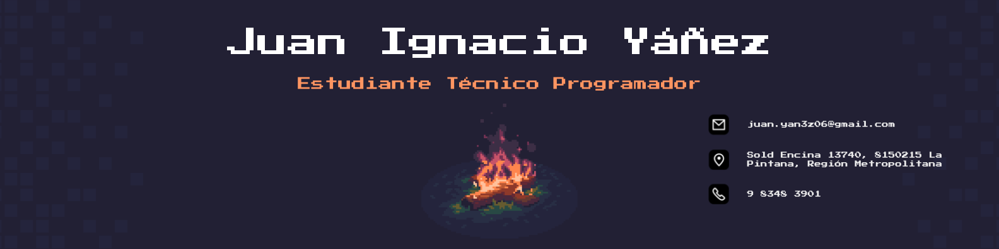

  

<h1 align="center">
  Hola, soy Juan Ignacio 👋
</h1>

  ¡Bienvenido a mi perfil de GitHub! Soy un <strong>estudiante de programación</strong> con experiencia en varias áreas de la tecnología. Me apasiona aprender nuevas herramientas, mejorar mis habilidades de programación y trabajar en proyectos colaborativos.

### Lenguajes de Programación:

-   **Python** (Nivel avanzado)
-   **HTML** (Intermedio)
-   **CSS** (Básico)

### Herramientas y Tecnologías:

-   **Git & GitHub** (Control de versiones, colaboración)
-   **Tkinter** (Para crear interfaces gráficas en Python)
-   **DOT** (Para crear diagramas de flujo)

## 📈 Proyectos Destacados

  

    <h3 style="text-align: center; color: #ff9561;">
      <a href="https://github.com/Panconhu3vo/Ejercicio-Integrado" style="text-decoration: none; color: #ff9561;">
        📝 Diccionario del Programador
      </a>
    </h3>
    

      Un proyecto colaborativo de un diccionario interactivo de términos de programación, desarrollado con <strong>Python</strong>, <strong>Tkinter</strong> y <strong>DOT</strong> para los diagramas de flujo.
    

  

