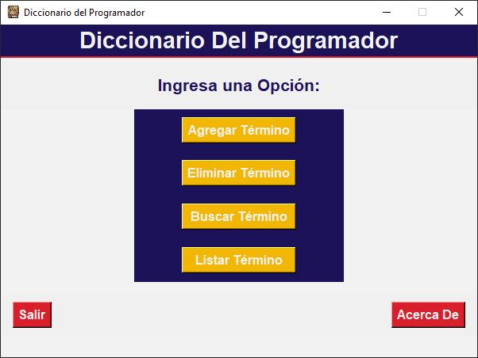
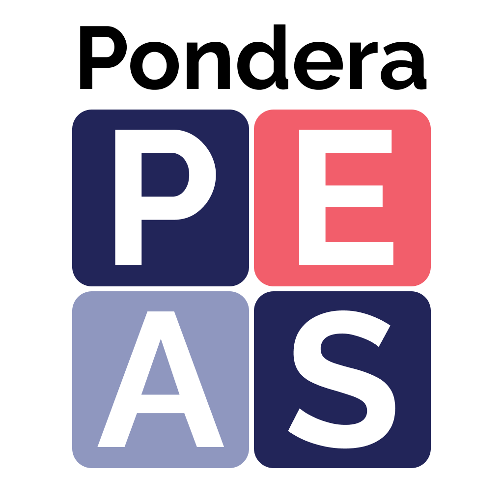
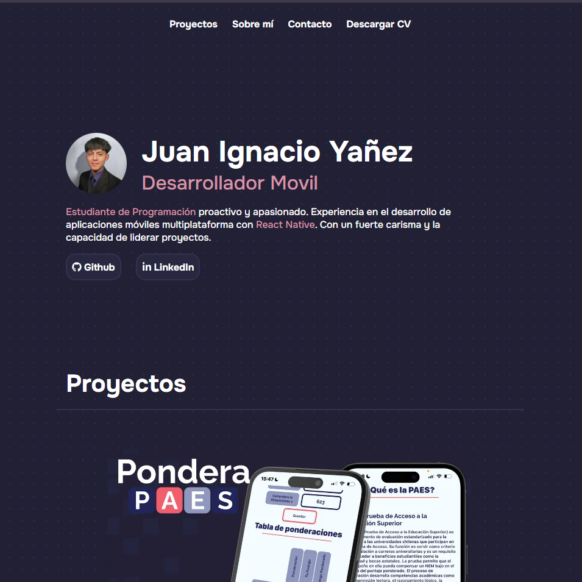

  

<h1 align="center">Hola, soy Juan Ignacio Yañez 👋</h1>

  ¡Bienvenido a mi perfil de GitHub! 
  Soy un <strong>estudiante de programación</strong> con experiencia en desarrollo móvil multiplataforma usando React Native. 
  Me apasiona enseñar y compartir conocimiento.

---

## 🖥️ Lenguajes de Programación

  
  
  
  
  
  

## 🛠️ Herramientas y Tecnologías

  
  
  

---

## 📈 Proyectos Destacados

  <table>
    <tr>
      <td width="120">
        
      </td>
      <td>
        <h3>Diccionario del programador, Inglés-Español</h3>
        

          Diccionario interactivo con +4000 términos para programadores, aplicando Python y Tkinter para la interfaz gráfica. Este sistema permite agregar, eliminar, buscar y visualizar términos técnicos de programación en inglés y español. 
          <a href="https://github.com/Panconhu3vo/Ejercicio-Integrado">Ver repositorio</a>
        

      </td>
    </tr>
  </table>

  <table>
    <tr>
      <td width="120">
        
      </td>
      <td>
        <h3>Pondera PAES</h3>
        

          Aplicación móvil diseñada para asistir a estudiantes interesados en la educación superior, proporcionando herramientas para calcular puntajes de ponderación, explorar información detallada de carreras universitarias (grados, duración, descripciones) y conocer los requisitos de admisión. 
          <a href="https://github.com/Panconhu3vo/Pondera-PAES">Ver repositorio</a>
        

      </td>
    </tr>
  </table>

  <table>
    <tr>
      <td width="120">
        
      </td>
      <td>
        <h3>Portafolio Web</h3>
        

          Portafolio web desarrollado, diseñe y construí todo el sitio desde cero, utilizando React y lo desplegué fácilmente gracias a Vercel. 
          <a href="https://github.com/Panconhu3vo/Pondera-PAES">Ver repositorio</a>
        

      </td>
    </tr>
  </table>

